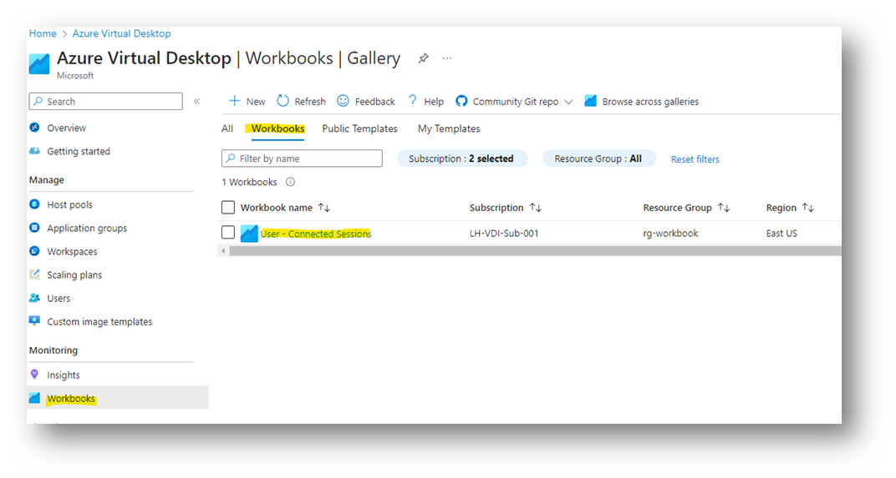

# Azure Virtual Desktop Overview

## Virtual Desktop Azure Firewall Configuration

## Virtual Desktop Azure Firewall Configuration General Network Information

- Subscription: LH-VDI-Sub-001

- Virtual Network: vnet-avd-eus-001

  - 10.120.32.0/21

- Peered to hub virtual network

  - vnet-hub-eus-001

- Azure Firewall

  - azfw-hub-eus-001

- Azure Firewall Policy

  - policy-azfw-hub-eus-001

## Azure Firewall Rules for AVD Backplane

These rules are to support a functioning Azure Virtual Desktop backend
environment. They're the required rules for session host outbound
connectivity. The rules were based off this document from Microsoft.

(note there are other rules in the collection below but they're to
support Cloud PCs.

- Rule Collection group: **rcg-microsoft-global-allow**

  - These contain the core rules for Azure Monitor, Defender,
    Windows Update, KMS.

  - They're global rules, meaning allowed for all traffic outbound
    from our Azure Firewall.

- Rule Collection group: **rcg-azure-vdi-allow**

  - Rule Collections:

    - **rc-net-avd-outbound-external-allow**

      - Required network outbound rules

    - **rc-app-avd-outbound-external-allow**

      - required application outbound rules

(note there are other rules in the collection above to support Cloud
PCs)

## Azure Firewall Rules for Active Directory Domain Services and AD DNS

- Rule Collection Group: **rcg-active-directory-client-allow**

  - Rule Collections:

    - **rc-net-adds-client-inbound-allow**

      - Required network ports for Session Hosts to AD DS
        servers

    - **rc-net-defender-for-identity-allow**

      - Required ports for AD DS servers to AD DS Clients for
        Defender for Identity monitoring.

## Azure Firewall Rules for Connectivity to the Internet

These are rules required for general internet browsing and access. These
are not rules for a functioning AVD backplane environment.

- Rule Collection Group: **rcg-vdi-outbound-internet-allow**

  - Rule Collections:

    - **rc-app-vdi-ops-outbound-internet-tls-inspection-disabled-allow**

      - Explicitly allowed URLs with TLS Inspection disabled

    - **rc-app-vdi-ops-outbound-internet-url-allow**

      - Explicitly allowed URLs with TLS inspection enabled

    - **rc-app-vdi-ops-outbound-internet-webcategories-allow**

      - Web Categories allowed with TLS inspection enabled

## Azure Firewall Rules for Connectivity to Bedford

These rules support the required application connectivity for users to
complete their work-related tasks.

(Note the rule collection below also contains rules for Cloud PC
development users).

- Rule Collection Group: **rcg-vdi-to-bedford-allow**

  - Rule Collections:

    - **rc-net-vdi-all-outbound-bedford-allow**

      - Network rules for client connectivity to Bedford
        applications and resources

    - **rc-app-vdi-all-outbound-bedford-allow**

      - Application rules for client connectivity to Bedford
        applications

# Avd user Sessions

1.  In AVD \> Monitoring \> Workbooks \> Workbooks \> User -- Connected
    Sessions



2.  To export \> hover over 3 dots \> Export to Excel


(If you need to get a user count \> In Excel, you can remove duplicate
username values from A column )


# azure-virtual-desktop-msix-app-attachmd

https://learn.microsoft.com/en-us/azure/virtual-desktop/app-attach-azure-portal

1.  Code Signing Cert on Internal CA \\ PFX file

    a. Created template on bedsubca001
    i. Code Signing -- MSIX 1. Ad security group -- PKI_Request_Code_sign 2. Did 3 year validity -- check if duration is ok

    b. Articles:
    i. https://sectigostore.com/page/code-signing-best-practices/
    ii. https://www.advancedinstaller.com/digital-signature-timestamp.html
    iii. https://katystech.blog/on-prem/msix-creating-a-code-signing-certificate-on-ad-ca
    iv. https://www.encryptionconsulting.com/what-are-the-best-practices-for-code-signing-and-how-to-implement-them/

2.  MSIX Packaging tool

    a. Articles - https://learn.microsoft.com/en-us/azure/virtual-desktop/msix-app-attach-create-msix-image?tabs=cim
    b. MS: We recommend using CIM for best performance, particularly
    with Windows 11, as it consumes less CPU and memory, with
    improved mounting and unmounting times.

3.  MSIX MGR

    a. Articles
    i. https://learn.microsoft.com/en-us/azure/virtual-desktop/msixmgr-tool-syntax-description
    ii. https://learn.microsoft.com/en-us/azure/virtual-desktop/msix-app-attach-create-msix-image?tabs=cim

    b. Quick CMD reference

    ```cmd
    msixmgr.exe -Unpack -packagePath \"C:\\msix\\myapp.msix\"
            -destination \"C:\\msix\\myapp\\myapp.cim\" -applyACLs
            -create -fileType cim -rootDirectory apps
    ```

4.  Azure Side

    a. AVD Host Pool -- MSIX Packages

    i. DAGS -- add to dag

    b. Azure storage account - lhprodvdifs / file share -- test one
    right now
    i. https://learn.microsoft.com/en-us/azure/virtual-desktop/app-attach-file-share

    ii. Share permissions 1. Session hosts need to be Entra Hybrid joined -- synced
    Billing OU which is in test phase right now , others are
    not synced

    2. Session host need Storage file data smb share reader

    a. On prem zad group for all avd session hosts can be
    assigned , currently Corp\\MSIXCOMP and has Storage
    file data smb share contributor

5.  Test and troubleshoot
    https://learn.microsoft.com/en-us/azure/virtual-desktop/app-attach?tabs=cimfs - Once package is published \> session hosts needs reboot

# Avd Recommendations

Recommendations from Microsoft - March 11 1024

a) Optimize AVD image

b) FSLogix

- Enable "Is Dynamic"
- Reduce the "Size in MBs"

c) Codingapppool

- Choose different SKU- perhaps D16s-v3 ?
- Disable printer redirection in RDP properties.
- Check the VM performance to ascertain the number of max sessions per host (always select Max and not average)

d) Add additional public IP to azfw

e) Coddsk2016pool

- Choose different SKU- perhaps D16 series with Scsi support.
- Enable SMB multichannel on lhprodvdifs001/fsprofiles

f) GPO changes

a. Computer -- AVD_Disable_RDP_Shortpath

- Windows components/Remote Desktop Services/Remote Desktop session host/Connections -- Select RDP
  transport protocols -- _changed from TCP to Use either UDP or TCP-_

- Nick had to make a change on the FW to allow enabling rdp shortpath support for avd session hosts

g) Another way of setting fslogix permissions is to directly go to
default share level permissions


Enable permissions for all authenticated users and groups

Select appropriate role to -Store file data SMB share contributor.

h) Snet-avd-eus-001

- On each Subnet

i. Edit service endpoints and add Microsoft.EventHub and Microsoft.Service.bus

i) Change the DNS servers.

j) Image builder to optimize market place image.
