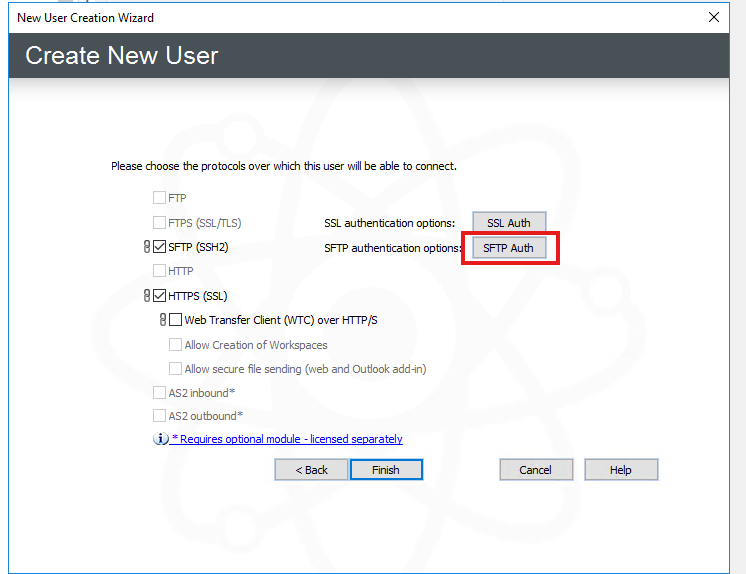

# Defines the current process how a client is onboard to EFT

# Initial Request

The request is usually create by Kim Ryan's Team in Cherwell. The request consist of the following
required information/Parameters:

- Client Name
- Client preferred Username for eft account setup (Same name as the root dir for the Client)
- List of IP Address for the specific client
- Client E-Mail (Depending on the client and what type of authentication
  if they provide a .pub key then we just use kryan@logixhalth.com for the user email)

Currently depends on the client:

- Public Key (Ideally we should have this for every client)

# EFT User onboarding

# Steps taken on the EFT server.

#### EFT setup with a Password

1. On the active EFT server, launch the console and navigate to the ‘LogixHealth SFTP Site
   | LogixHealth Clients’ node.
1. Right click on the node and select ‘New User’.
1. Fill in the username as CLIENT_NAME.
1. Click generate password.
1. Click Next, Next, and Finish accepting the default values supplied.
1. Send the password generated to Kim Ryan via Bitwarden.

#### EFT setup with a public key

1. On the active EFT server, navigate to "D:\Public Keys"
1. Save the attached key on the server following the naming convention:
   "Client_Name Public Key.pub
1. On the active EFT server, launch the console and navigate to the ‘LogixHealth SFTP Site
   | LogixHealth Clients’ node.
1. Right click on the node and select ‘New User’.
1. Fill in the username as CLIENT_NAME.
1. Click generate password no need to save it as it wont be used to authenticate or
   available as a login option.
1. Click Next, Next, and Finish accepting the default values supplied.
1. Select SFTP Auth -> Select Key Manger -> Import -> "Browse to D:\Public Keys" and SELECT the key
   you saved for the client.

1. Once its added in select Edit -> Scroll down on the List of keys: and select the last one
   that you imported in and hit finish!
1. Send the password generated to Kim Ryan via Bitwarden.

# Steps taken on the Palo

1. Login to bednwfw003 (client Palo tunnel pair) and create the following address
   objects: client-name_SFTP_Peer.
1. Create the address group _SFTP_Peer-IPs_ and add the object created in step 1. Only if the
   allowed IPs are more then one.
1. Add the address object group client-name_SFTP_Peer to the existing SFTP allow rule
   LogixHealth_EFT_SFTP_Allow.
1. Commit changes.
