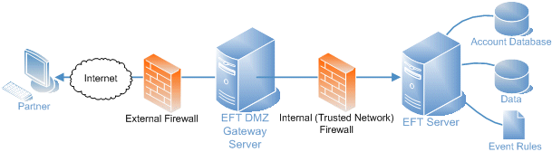
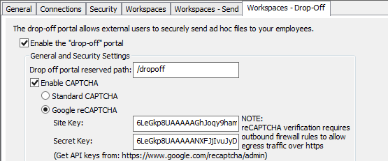

# Globalscape EFT LogixTransfer Environment Overview

The purpose of this document is to provide an overview of our
GlobalScape EFT environment. This is not intended to be a GlobalScape
EFT training guide, but rather a detail on how the product is deployed
in our environment.

**Overview:**

LogixHealth utilizes the GlobalScape EFT product for 2 main purposes:

1.  **File Transfer** -- The transfer of client files such as patient
    charts to our SFTP server (Ipswitch/HQSFTP01 replacement)

2.  **Workspaces (Web File Sharing)** -- The ability to share files and
    folders securely with both internal and external users. This
    functionality is similar to DropBox but all data is housed within
    our private data center vs. the cloud.

3.  **Licensing:**

- GlobalScape EFT is licensed by module. As of this writing, we have
  the following license entitlements:

  - EFT Enterprise Server (Active and Standby)

  - EFT Auditing and Reporting Module -- ARM (Active and Standby)

  - Multisite DMZ Gateway (Active and Standby)

  - Advanced Security Module - ASM (Active and Standby)

  - EFT Workspaces (Active and Standby)

- Licenses and invoice information can be found here:
  [\\\\corp.logixhealth.local\\LH-Files\\Department_Shares\\Infrastructure\\GlobalScape](file://corp.logixhealth.local/LH-Files/Department_Shares/Infrastructure/GlobalScape)

- License keys must be activated on both the Active and
  Passive cluster nodes in order for the modules to work correctly.

**Architecture:** Our current deployment consists of two GlobalScape EFT
servers configured in a Windows Failover Cluster (Active Passive) behind
the Palo Alto Firewall. The primary storage is a NetApp share for both
SFTP and Workspace (Web File Transfer) sites. All communication is
proxied through the EFT DMZ Gateway node.

- **Servers**

  - BEDEFT001 (Primary Cluster Node) -- 10.10.32.90

  - BEDEFT002 (Secondary Cluster Node) -- 10.10.32.91

  - BEDEFTGW001 (DMZ Gateway Node) -- 10.10.72.50

- **Site Links**

  - **Web Transfer Client -** https://transfer.logixhealth.com:1998/EFTClient/Account/Login.htm#/

  - **Customer Drop-off Portal -** https://transfer.logixhealth.com:1998/messageportal#/dropoff

- **Storage --** The primary data storage for both the web file
  sharing and SFTP is the Bedford NetApp. Access to the data is via
  the corp\\svc_sftp account which is configured as the service
  account for the "EFT Server Enterprise" Windows Service. The various
  data paths are outlined below and can be viewed in the GlobalScape
  console under each site (General Tab🡪Site Root Folder):

  - SFTP Data: [\\\\corp\\lh-files\\LHData\\Web Client File
    Exchange\\](file://corp/lh-files/LHData/Web%20Client%20File%20Exchange/)

  - Web File Share Data: [\\\\corp\\lh-files\\LHData\\Web Client
    File
    Exchange\\](file://corp/lh-files/LHData/Web%20Client%20File%20Exchange/)

- **Administration Console**

  - Management of the GlobalScape environment can be done through
    the GlobalScape EFT GUI console located on the active cluster
    node (e.g. bedeft001). Simply RDP to the server and launch the
    console.

  - Access to the EFT console is restricted by AD user group.
    Members of the "GlobalScape_Console_Admins" group will have full
    access. There is also a local admin account, which is stored in
    [Secret
    Server](https://locksmith.logixhealth.com/dashboard.aspx#{'tId':70,'fId':'-1','s':'Nessus','inSub':false,'tptId':null,'status':'Active'}).

- **Web File Transfer Site**

  - **Site Authentication --** This site is AD integrated and
    members of the "GlobalScape_Web_Console" group are allowed
    access.

  - **Web File Transfer --** This is where internal users would go
    to initiate file sharing for both internal and external users:
    https://transfer.logixhealth.com:1998/EFTClient/Account/Login.htm#/

  - **Drop-off Portal --** This is where clients would go to send
    files to us:
    https://transfer.logixhealth.com:1998/messageportal#/dropoff

  - **Google reCAPTCHA --** The GlobalScape drop-off portal has
    Google reCAPTCHA enabled to add another layer of security to the
    site. GlobalScape natively supports this option. Here are the
    details:

  - **Site:** https://www.google.com/recaptcha

  - **Google User ID:** Logixhealthit (Password in Secret Server) --
    From here, you can administer what domain Google reCAPTCHA will
    be enabled for and generate the site keys necessary for the EFT
    configuration.

> 

- **Site Security**

  - **Certificate --** The Web File Transfer site utilizes a
    DigiCert public certificate. The site name is
    transfer.logixhealth.com. Certificate information is stored in
    Secret Server and within our DigiCert customer portal.

  - **Networking**

    - HTTPS for file share site runs on port 1998

    - DMZ Gateway for secure communication runs on port 44500

- **Branding --** Our implementation of GlobalScape involved heavy
  branding. Here's an overview:

  - All customizations reside in this folder on each EFT cluster
    node: C:\\Program Files (x86)\\Globalscape\\EFT Server
    Enterprise\\web\\custom. GlobalScape looks to that folder first
    to load any customizations such as CSS and images.

  - Overview of branding process is located here:
    [\\\\corp.logixhealth.local\\LH-Files\\Department_Shares\\Infrastructure\\GlobalScape\\Rebranding_Customizing
    the Web Transfer
    Client.pdf](file://corp.logixhealth.local/LH-Files/Department_Shares/Infrastructure/GlobalScape/Rebranding_Customizing%20the%20Web%20Transfer%20Client.pdf)

  - When upgrading the product, all previously branded files must be
    recreated. For example, if the upgrade introduces a new CSS
    file, we must save a copy of the new file, modify it and place
    it in the "Custom" folder.

  - All branding activities are initiated by the Brand Identity
    department and involve a UI Developer form Dev Engineering.

  - All branded files are stored by Dev Engineering in Microsoft
    TFS. The current folder is here:
    http://bedtfsapp001:8080/tfs/Main/Projects/LogixUX/\_versionControl?path=%24%2FProjects%2FLogixUX%2FMain%2FProjectCommons%2Fbuilds%2FGlobalscape%20EFT&version=T&\_a=contents

- **SFTP Site**

  - **Site Authentication --** This site is not AD integrated and
    all client accounts are created locally on the server using the
    "LogixHealth SFTP Client" template. Passwords expire every 120
    days.

  - **Site Security**

    - **Certificate --** The SFTP site utilizes a GlobalScape
      generated certificate which is stored in Secret server.

  - **Networking**

    - SFTP utilizes port 22.

    - DMZ Gateway for secure communication runs on port 44501

    - Site address is 66.97.189.50 or transfer.logixhealth.com
      (port 22/21)

**Maintenance and Support:**

- **Software Updates/Upgrade**

  - Product updates can be found here**:**
    https://www.globalscape.com/product-downloads

  - Operating system patching and updates for bedeft001/002 can be
    performed by failing over between cluster nodes, resulting in a
    brief downtime while the GlobalScape app fails to the Passive
    cluster node.

  - GlobalScape upgrades will require a downtime, as both nodes need
    to be taken offline and upgraded. Please see the GlobalScape
    release notes for the exact upgrade procedure for the version
    you are upgrading to..

  - The "Drain Server" command should be launched prior to the
    upgrade to gracefully end all existing connections and block any
    new connections. This can be launched in the GlobalScape Admin
    Console (File🡪 Drain Server). More information about this
    command and others can be found in the latest product
    documentation.

  - Branding must be reinstated, as indicated in the branding
    section of this doc.

- **LogixHealth Internal Support --** Internal support for GlobalScape
  can be directed to the Systems Administrator team. Any branding
  related issues should be directed to the Brand Identity team.

- **Vendor Support --** Tickets can be opened online via their web
  form

  - Web: https://dynamic.globalscape.com/support/techsupport.aspx

  - Phone: 1-210-366-3993

  - NOTE: Support entitlement is validated through our server
    license key: AGRBUADCQHJ6GD <!-- cspell:disable-line -->

- **Documentation**

  - GlobalScape:
    https://help.globalscape.com/help/helpindex/#t=Globalscape_Online_Help_Files.htm
