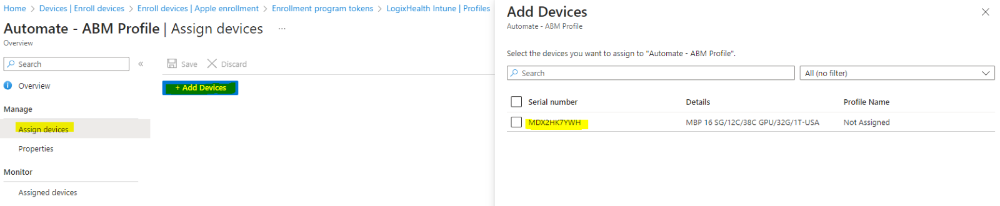

# Logixhealth: Apple Configuration Overview

## Overview

This document defines and outlines the different end-point management configuration we have for Apple deices and the other polices that are being managed.

## Mac Devices (Laptops)

## Synopsis-Mac-Devices

Set up automated device enrollment in Intune for new or wiped Macs purchased through an Apple enrollment program, such as Apple Business Manager or Apple School Manager. With this method, you don't need to have the devices with you to configure them. Intune automatically syncs with Apple to obtain device info from your enrollment program account and deploys your preconfigured enrollment profiles to Macs over-the-air. Prepared devices can be shipped directly to employees or students. Setup Assistant and device enrollment begin when someone turns on the Mac.

IMPORTANT:

For Older Macs and those that are not purchased through the apple account and are not directly enrolled in Apple Business Manager following the following section.

Refer to this [section](#steps-to-add-a-mac-to-apple-business-manager-abm)

## Prerequisites

- Apple Business Manger Access
- A list of device serial numbers or a purchase order number for devices purchased through Apple
- MDM Authority Setup – https://learn.microsoft.com/en-us/mem/intune/fundamentals/mdm-authority-set
- Apple MDM Push certificate (SETUP Already)


Setup: [Enrollment Program Token](https://learn.microsoft.com/en-us/mem/intune/enrollment/device-enrollment-program-enroll-macos#create-enrollment-program-token)

## Apple Corporate account for Purchasing

Currently: Tony Castellano account is enabled for buying and the devices are automatically added to your Apple Business Manager and assigned to the Microsoft Entra on the LogixHealth Tenant.

Example Device: Search based on the S/N and it should automatically be joined to LogixHealth Intune MDM server if not edit the MDM server and join it.


## Creating an Apple Enrollment Profile

The profile defines the enrollment experience for your organization's Mac devices and enforces enrollment policies and settings on enrolling devices. The profile is deployed to assigned devices over-the-air.

At the end of this procedure, you will assign this profile to Azure AD device groups.

1. In the admin center, go to: **Devices** > **macOS** > **macOS enrollment** > **Enrollment program tokens**.
2. Select an enrollment program token. Select **Profiles** > **Create profile** > **macOS**.
3. For **Basics**, enter a name and description for the profile so that you can distinguish it from other enrollment profiles. These details aren't visible to device users.


Create Enrollment Program [Token](https://learn.microsoft.com/en-us/mem/intune/enrollment/device-enrollment-program-enroll-macos#create-enrollment-program-token)

**NAME:** Automate - ABM Profile

**Configuration settings:**

- **Enroll with User Affinity:** Enroll devices that are associated with an assigned user. Choose this option for work devices that belong to users, and if you want to require users to have the Company Portal app to install apps. Multi-factor authentication (MFA) is available with this option.


### Adding the Company Portal to the MAC OS:

Company Portal for [macOS](https://learn.microsoft.com/en-us/mem/intune/apps/apps-company-portal-macos)

Using the macOS LOB app but it requires the app to be updated periodically, on the Intune Portal. The reason is they do not have a VPP app for MacOs only for iOS.
**APP CREATED AS A LOB (Line of Business App)**

The app is set to be required for all enrolled devices, so once the device is enrolled into the Tenant and checks in it should push out the application onto the device.

### Assigning Devices to the Automated Profile

1. Select the Profile you want to add devices and Select **Assign Profile**.
2. Navigate to **Intune** > **Devices** > **Enroll Device** > **Apple Enrollment** > **Enrollment Program Tokens** > **LogixHealth Intune**.
   [MSFT-Doc](https://intune.microsoft.com/#view/Microsoft_Intune_Enrollment/DepTokenMenuBlade/~/enrollmentprofiles/tokenId/f38c6651-1065-499f-a25b-2c0ace6bd3c7)

Assign Profile



PROFILE NAME: Automate - ABM Profile

The following groups will be added dynamically based on the following criteria:

- **Mac_Device_All** -> Dynamic group “(device.deviceOSType -eq "macMDM") and (device.deviceOwnership -eq "Company")” only for correctly joined MAC devices.

Add the Device to the Following group manually if the machine does not qualify for the above query:

- **Intune_macOS_Kerberos_Users** – Syncs the local account with AD account password.
- **Intune_APP_OneDrive_MAC** – Deploys OneDrive App.
- **Intune_Devices_OneDrive_Known_Folder_Moves_Macs** – OneDrive Backup and Mapping policy.
- **Intune_macOS_AzureAD_SSO_User** – It auto logs in to other SSO apps on the mac once you authenticate.
- **Mac_Devices_Update_Non_exec** – Auto-Update Policy for Mac.
- **Mac_Create_LocalAdmin** – Pushes a shell script down in order to create a local IT managed account.

### First time MacOS post enrollment user steps

1. Once the machine has a profile attached and is synced up on the boot up they will be prompted for logging into Microsoft and are forced to setup and MFA(Only if this is the first time setting up the device)
1. Once logged in with the temp password the the initial mac is loaded in it will automatic install the office suite, on the reboot toggle on file vault for encryption, add defender and the compliance police.
1. The first time it will also ask the user to login into Company Portal and once logged in it should check into Intune and report back the compliance state.

### Syncing the AD password with the Local login

#### Remote Scenario

1. Make sure you are connected to the VPN if remote.
2. Once connected, the user will be prompted the following.
3. Once synced, you will be prompted to log in with your email address and password. Then enter the network password and Mac password so they sync.

!A screenshot of a login screen

4. Reboot PC while in the network and reenter the same network password twice (even if it says mac password).

!A screenshot of a phone

#### In Office User

1. Plug in the computer in the company’s network and wait to pick up the sync.
2. Follow the same instructions as the Remote steps.

### Enforcing Local Admin account and Downgrading

The account is being pushed down using a shell script that creates an account called -> "Wrkstlh".

Following settings for the shell script:

!A screenshot of a computer

The new Admin account password is controlled by the following cipher based off the device serial number. In this example, the script determines the device serial number, then passes it through two really basic tr ciphers and finally base64 encodes it. This is slightly better than having all of your devices with the same Admin password but is only as secure as the cipher you use.

**SCRIPT location** -> \\corp\lh-itinfra\Software\Apple\Scripts

Run the script on a bash window and enter the command Machines unique Serial Number for the password to be deciphered.

### OneDrive Backup

#### Re-Provisioning Mac

1. Navigate to the device in Intune.
2. Select the **Wipe** feature and set the password to a 6-digit code and store that value in Bitwarden if needed as a recovery key in the future with the old machine's ID and Serial Number.
3. For the option for **Obliteration Behavior** select: **Obliterate with warning**.

If the preflight check for EACS fails, the device reports a Success status and then tries to erase itself.

If the preflight check succeeds but the actual EACS fails, the device still tries to erase itself.

ETA: It takes about 10 seconds after the machine checks in and starts the wipe process and after 10 minutes it reboots the device remotely and goes back to a new user machine setup.

Once you do that you can follow the rest of the steps to have the user join the device via MFA and join it to the Logixhealth, Inc Profile.

## Steps to Add a Mac to Apple Business Manager (ABM)

1. **Create a new (temporary) partition** on the computer you want to add to ABM. 50 GB is enough for Ventura and presumably previous OS’s.
1. **Start the Mac in recovery mode**:
   - **Intel Macs**: Press CMD + R at boot.
   - **Apple Silicon**: Press and hold the power button until ‘loading options’ appears and select ‘Options’ from the menu.
1. **Re-install MacOS**:
   - Once in recovery, select the option to re-install MacOS.
   - Let the process run. Time here varies, but it only took about 30 minutes on my M1 MBP despite initially saying it would take 2.5 hours.
1. **Reboot into the new partition**:
   - The computer should automatically reboot into the new partition.
   - If it doesn’t, you can do so manually:
     - **Intel Macs**: Hold Option at boot.
     - **Apple Silicon**: Press and hold until ‘loading options’ and select your new partition.
1. **Add the Mac to your Apple Business Manager account**:
   - At the setup screen, use Apple Configurator on iOS to add the Mac to your ABM account.
1. **Shutdown the Mac** once the device is added successfully.
1. **Assign the Mac to an MDM**:
   - Login to Apple Business Manager, go to devices, select your newly added Mac, and assign it to an MDM.
   - You’ll have to do this even if you have a default MDM set.
1. **Sync your MDM with ABM**:
   - Make sure your MDM syncs with ABM to see the device is added.
   - Refresh/Sync from Intune manually and ensure the new Mac is showing in the list of devices from ABM.
1. **Start the Mac in the original partition**:
   - Refer to step 4 if you're unsure how to select the right partition.
1. **Delete the temporary partition** you made.
1. Once you remove the old partition you can reclaim the storage and the device is not fully managed and can be leveraged for other intune polices.

## Mobile Devices

The following section defies the different process we have to enroll devices into Intune and be manged by LogixHealth Inc.

## Enrolling Existing iOS Devices into Apple Business Manager and Endpoint Manager (Intune)

### Synopsis-Existing-Devices

This document is the enrollment process for iOS devices in the scenarios below:

- Existing Company-Owned Devices not Enrolled in Apple Business Manager and Intune
- New Company-Owned devices not enrolled in Apple Business Manager and Intune

The enrollment method used in this document registers the devices in our Corporate Apple Business Manager account, syncs them to Intune and allows them to be enrolled in our automated device enrollment process.

This method is not for devices we are unable to wipe and reset, including company-owned devices. For those, we can enroll as personal and corporate enroll when the user returns the device permanently.

### Step 1 – Existing devices, remove from the IT Owned Apple ID

If the device you’re enrolling is NEW, you may skip this step. It is only for phones previously registered to an Apple ID/iCloud account.

As of this writing, we have discovered the accounts below owned by IT that may have registered devices. The credentials are in Secret Server. The MFA will be tied to one of the IT on-call phones.

- Logixhealthtech@logixhealth.com
- LogixTech@icloud.com
- kellilogix@gmail.com
- logixittech@gmail.com

1. Record the Serial number in a handy location, we will need it later.
2. Reset the device: `Settings > General > Transfer or Reset iPhone > Erase all content and settings`
3. Leave the device powered off or at the initial setup phase.
4. Log into the AppleID of the account owning the device. Locate the device and delete/remove it from the account.
5. Move onto Step 2.

### Step 2 – Import the device(s) into Endpoint Manager (aka Intune)

**Goal:** To prepare the device for Apple Configurator and be able to import the device into Apple Business Manager.

1. First formulate a CSV File containing the Serial Number of the device in column A and a device name in Column B. Don’t use any headers, for example:

   ```
   SerialNumber, DeviceName
   ```

1. Log into Endpoint Manager at https://endpoint.microsoft.com
1. Go to `Devices > iOS/iPadOS > iOS/iPadOS enrollment`
1. Click `Apple Configurator`
1. Click `Devices`
1. Click the `+ Add` button
1. In the Add Devices window, select the Enrollment profile and your CSV file created previously.

   - Single User devices use the `EnrollmentProfile-iOS-WithUserAffinity-CompanyPortal`
   - Shared Devices, use the `EnrollmentProfile-iOS-NoUserAffinity`

1. Click `Add`
1. Move on to step 3.

In most use cases we will be using the `EnrollmentProfile-iOS-WithUserAffinity-CompanyPortal` as the device will be tied to a single user.

### Step 3 – Prepare and import the device into Apple Configurator

This step assumes you’re using an Apple computer already configured for device enrollment with LogixHealth’s Endpoint Manager. If you’re using a new device, please refer to the documentation below to get Apple Configurator setup:

Apple Configurator Setup Documentation

Apple Configurator 2 can be downloaded from the Apple Store.

In Apple Configurator you can verify the device is properly setup if the EnrollmentProfiles are present by following the steps below:

1. In Apple Configurator > Preferences > Servers, you will see the two profiles.

#### Preparing the Device

1. Connect the device to the Apple computer with a USB cable. The device will now appear in Apple Configurator.
1. Select the Device and click the `Prepare` button.
1. In the Prepare Devices window select the options below:

   - Manual Configuration
   - Add to Apple School Manager or Apple Business Manager
   - Allow Devices to pair with other computers

1. Click `Next` and the device will now go through the preparation process. Once complete just shutdown the device or leave it at that stage.

### Step 4 – Transfer the Device from Apple Business manager to Intune

1. Log into https://business.apple.com
1. Go to devices and select the Device you just prepared, click `Edit MDM Server`
1. Next, under `Assign to the following MDM:` Select `LogixHealth Intune` and click `Continue`.
1. At the confirmation page click `Confirm`.

### Step 5 – Sync the devices to Endpoint Manager

1. Go to https://endpoint.microsoft.com
1. Next click `Devices > iOS/iPadOS > iOS/iPadOS enrollment > Enrollment Program Tokens`
1. Click the `LogixHealth Intune Token`
1. Next click `Devices` and then click the `Sync` button.

The sync will run and usually the device will appear in 2-3 minutes, just click refresh to verify.

You will not be able to re-sync for 15 minutes.

Once the device is added it will be assigned the default profile of `EnrollmentProfile-iOS-UserAffinity-CompanyPortal`.

The profile is for devices that will be owned by a single user. In the case of shared devices, you may select `NoUserAffinity` profile. That alleviates the need for a user to be signed into the Company Portal.

### Step 6 – Go through the device setup

Next, we can turn on the device and perform the initial setup. Once the Setup Assistant completes the user will need to sign into the Intune Company Portal to complete enrollment.

### ISSUES to fix:

- Admin account push/demoting the regular account to a no local admin.
