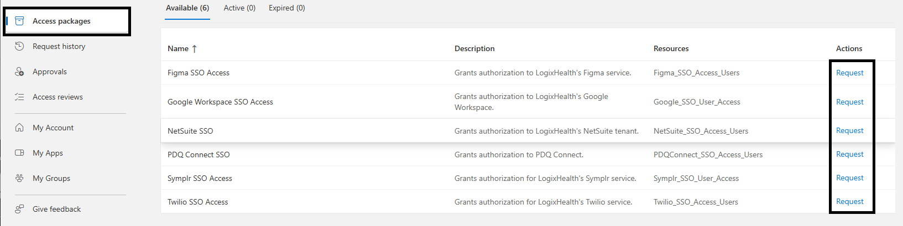

# Access Packages

Azure Access Packages are part of Entra ID’s entitlement management, designed to streamline access management for users requiring specific resources. They enable administrators to bundle permissions, roles, and access to resources like groups, apps, and SharePoint sites into a single package. Users can request these packages through a self-service portal, and approvals can be automated, or manual based on configured policies.

# How to access my Access Packages?

All eligible access packages will be accessible by navigating to the following URL: https://myaccess.microsoft.com/

# How to request access?

When requesting access through access packages, always use your non az account. ex: aconcepcion@logixhealth.com

On the right side of each access package, there will be a request button you can click on (screenshot below).

Clicking on “Request” will bring up a window with details about the resource you are requesting access for (screenshot below).

 

Clicking “Continue” will bring up a justification window where you will give the reason for needing the access (screenshot below). Optionally, if you know you only need temporary access, you can choose to enable “Request for specific period?” which will then ask for the start data and end date.

 

Once you click “Submit request”, the approver will receive the request and handle the approval.

# Access Packages Best Practices

1. Minimize Excessive Permissions

- Grant the least privilege required for users to perform their tasks. No more and no less.

2. Use Access Reviews

- Set up periodic access reviews to validate that users still require access. Many times a user will only need the access for that set period and never again.
- Automate reminders for reviewers to keep access up-to-date. This can be configured while creating the access package.

3. Define Clear Approval Policies

- Establish approval workflows that align with your organization's policies. Decide whether their manager or application owner approves.
- Utilize multi-stage or multiple approvers for sensitive access packages. You can configure as many approvers as you want.

4. Automate Expiration and Renewal

- Configure access to expire automatically after a set period. Doesn’t always need to be the case if it will be part of their daily operational procedures.
- Allow users to re-request access if they need continued access, subject to a fresh review.

5. Segregate Packages for Different Scenarios

- Create separate packages for internal employees, contractors, and external partners. This is more important to do when the group access is tied to a specific role.
- Tailor access based on user type and organizational need.

6. Leverage Conditional Access

- Combine access packages with Conditional Access policies to enforce additional security measures like MFA, location restrictions, or device compliance. LogixHealth utilizes Conditional Access policies already so we are mostly covered here.

7. Document Access Justifications

- Require users to provide justification for access requests to improve traceability. Not everyone needs the access or should have the access. Justification allows us to gauge the need vs the want.
- Retain logs for audits and compliance purposes. More likely than not, having a paper trail of all actions is always helpful during incident response and audits.
