# Authlite Overview

# Group Pairs:

Group pairing is the key concept of AuthLite. In AuthLite configuration,
you specify the group pairings.

AuthLite breaks this down into 1Factor (left side) and 2Factor (right
side) tag groups.

The 1F groups on the left represents current AD group memberships
accounts should be in for that specific access. Once MFA is achieved
during the logon process, AuthLite will swap out your 1F tag groups with
the corresponding 2F tag group pair on the right.

**(the 1F tag group is what is being denied in the GPOs --in next
section)**

**Corp\AuthLite Users** -- Users should be added here (will happen automatically once registered for token)

**Corp\AuthLite 1-Factor Session Tag** do not add any members here (Nested inside of AuthLite Users)

**Corp\AuthLite 2-Factor Session Tag** -- do not add any members here

Example: DA_Account will be part of `CORP\AuthLite-Protect Domain Admins` and `CORP\AuthLite Users` in AD. This account
will not be part of `CORP\Domain admins`. Once this
DA_Account authenticates via MFA, while building the Kerberos ticket,
AuthLite will swap out the of `CORP\AuthLite-Protect Domain Admins` with the corresponding group pairings, in this case of
`CORP\Domain Admins`.

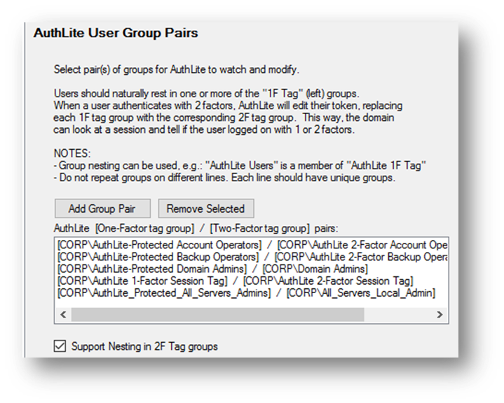

# Group Policies

- AuthLite depends on two GPOs:

  - GPO -- Computer -- Block Logon by AuthLite 1-Factor Session
    Tag -- scoped at root to apply to all member
    servers and workstations in the domain.

  - This GPO denies all logon types that have the 1-factor session
    tag. The 1-factor session tag will be replaced by 2-factor
    session tag in the Kerberos ticket via AuthLite group pairing
    once AuthLite recognizes MFA has been succeeded.

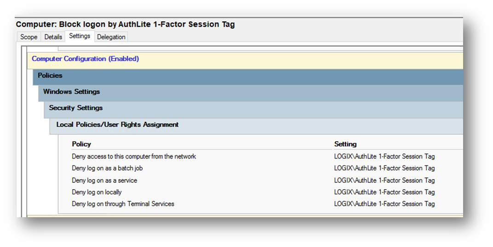

- GPO -- Computer -- Allow Network Access by AuthLite 1-Factor
  Session Tag (Override Deny)

- This GPO is required to over ride the logon from the network for
  user logons, GPOs/sysvol access, etc. This setting is intentionally
  blank.

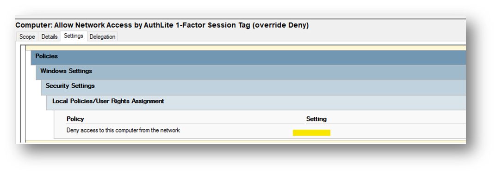

- OU Exemption

  - Computer -- AuthLite -- OU Exemption

  - The block logon 1-factor session tag GPO is scoped at the root
    of domain. This was what was done during the AuthLite
    default-setup script. Unfortunately, even if that GPO was
    un-scoped, the settings still remain and "stick". To undo, you
    have to blank out those security settings (screenshot).

    - Might want to do this if:

      - You do not want to remove a user from 2FA entirely and
        just want to exempt one OU.

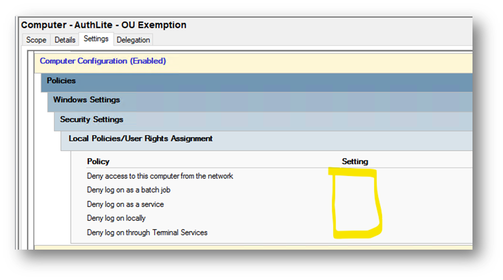)

# Domain Controllers

A separate instance of Authlite is installed on every DC pair:

- LogixHealth.local

  - BEDPROOTDC001

  - BEDPROOTDC003

  - AZEUSROOTDC001

  - AZUESROOTDC002

- Corp.logixhealth.local

  - BEDPCORPDC001

  - BEDPCORPDC003

  - AZEUSCORPDC001

  - AZEUSCORPDC002

- LogixHealth.com (trial license -- not licensing )

  - BEDDC003

  - BEDDC004

- MRSI.local -- nothing in that domain except DCs

# Break Glass Accounts

Backup accounts are stored in the Infrastructure safe.

# Token Administration

## Enrollment

### Option 1: Authlite Enrollment App (On BEDPAUTHLITE001)

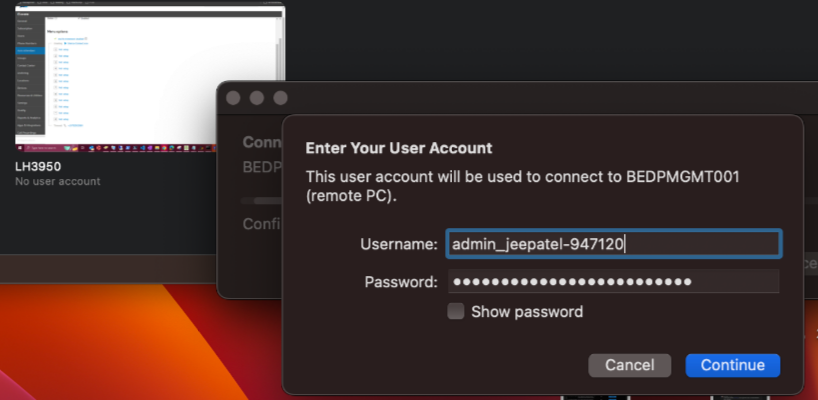

### Option 2: From AuthLite Configuration (only accessible on Domain Controllers)

\> Management Tasks \> Set up an OATH Token \> Fill out Domain name and
Username \> Set up OATH Token button \> Scan QR code from Authenticator
app

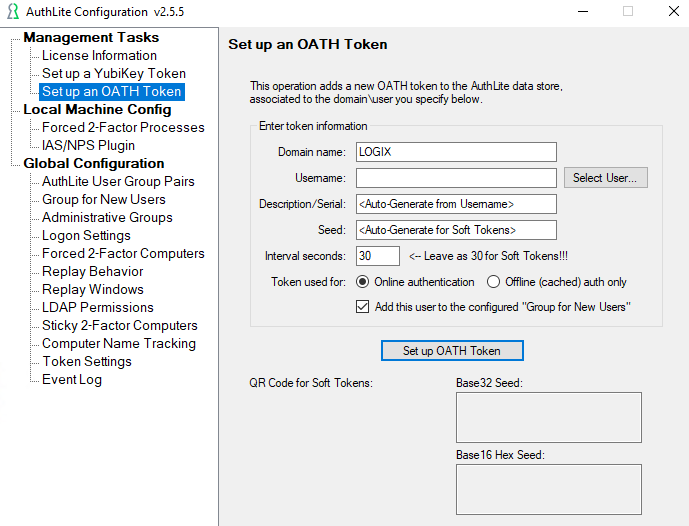

### Option 3: Self-Registration portal

End users can enroll their OAUTH token themselves through the portal

Link: https://authlite.logixhealth.com/

Currently for Corp.logixhealth.local

1.  Enter Username & Password when prompted (Corp admin account) \`

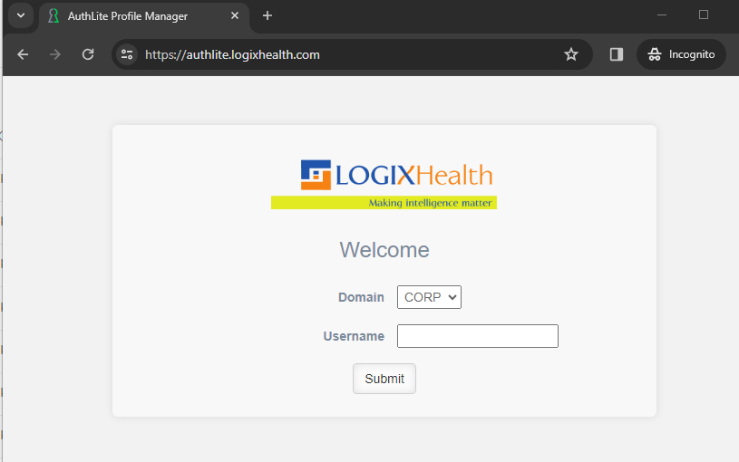

2.  Add OATH Token \> Online

https://www.authlite.com/docs/2_5/id_1374743964/ - for more info on offline token

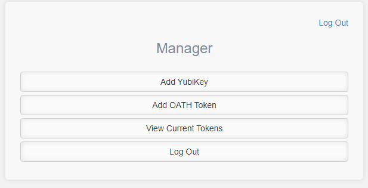

3.  QR Code will now appear \> Open Microsoft Authenticator app \> Add
    account \> Work or school account \> Scan QR code \> Confirm OATH
    token value \> Done

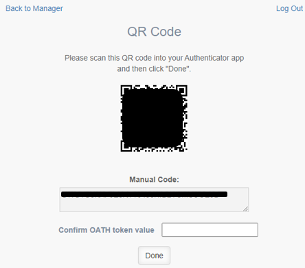

## AuthLite Token Manager

AuthLite Token Manager is installed on BEDPAUTHLITE001

AD Group for server access and access to modify keys: "Corp\\Authlite
Support"

### Re-Registration

Unassigning tokens (possibly used to have user re-enroll for
troubleshooting purposes)

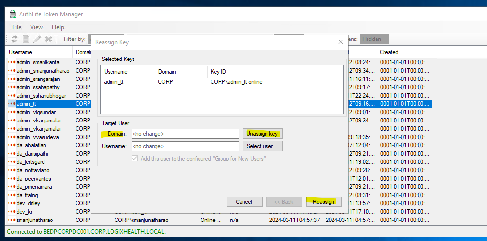

Right click on the username/token \>
Unassign key \> Reassign & remove user from "Corp\\AuthLite Users" group
and they would be able to re-enroll

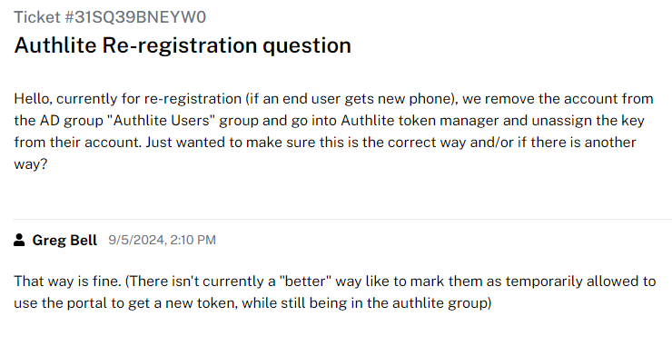

# Login Process

## Remote Desktop Connection - Agent Installed

If the agent is installed on your workstation (or on your jump server /
server you are on and trying to rdp from). The One-time passcode field
in RDC will only come up if Authlite sees that you're in "AuthLite
Users" group (when you enter your username , it will detect).

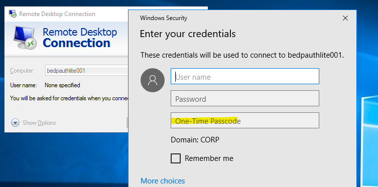

##

## Remote Desktop Connection - Agentless

If you don't have the agent installed on your workstation(or on your
jump server / server you are on and trying to rdp from), you would need
to include your 6 digit token from your authenticator app in the
username in the format of (see screenshot for example)

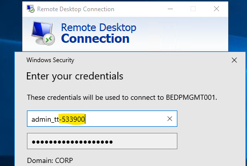

## Remote Desktop Manager

RDC Manager from Microsoft

Link: https://learn.microsoft.com/en-us/sysinternals/downloads/rdcman

If creds are not saved, it will prompt you with login window

For the best user experience, servers and the admin's workstation should
have the Authlite agent installed.

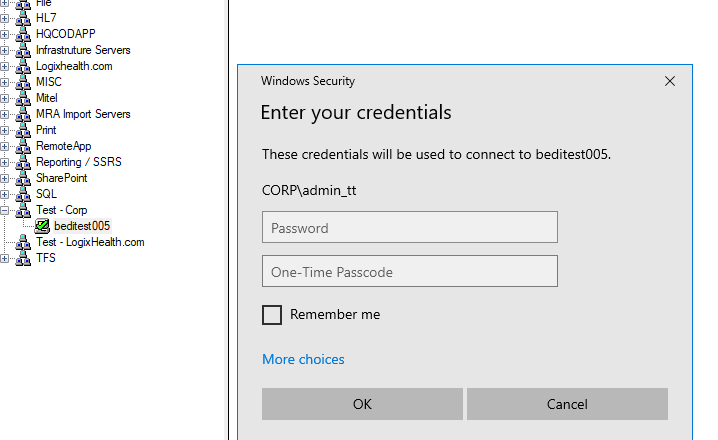

## SQL Server Management Studio

Authlite agent is required to be installed on the workstation or server
in order to authenticate to SSMS

SSMS troubleshooting link:

https://www.authlite.com/docs/2_5/id_1635562091/

If ever encountering this error:

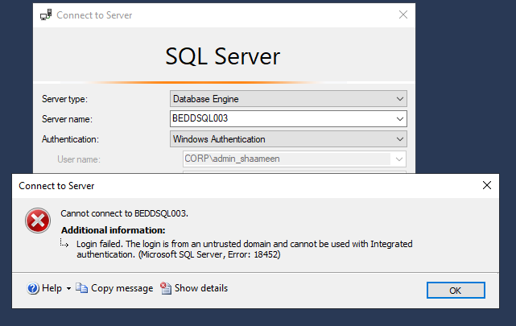

[Using Kerberos Configuration Manager for SQL Server - SQL Server \|
Microsoft
Learn](https://learn.microsoft.com/en-us/troubleshoot/sql/database-engine/connect/using-kerberosmngr-sqlserver)

SPN on needs to be set for the account running MS SQL SVC.

SETSPN -A MSSQLSvc/ServerName.CORP.LOGIXHEALTH.LOCAL
corp\\svc_serviceAccount

# Servers/Workstations Agent Install

Agents require an immediate restart

## Servers -- Install via Group Policy

GPO "Computer -- AuthLite Agent Installer"

Computers that get this policy will get the agent loaded and installed
during their next reboot, then the install will happen prior to login
screen, and reboot again.

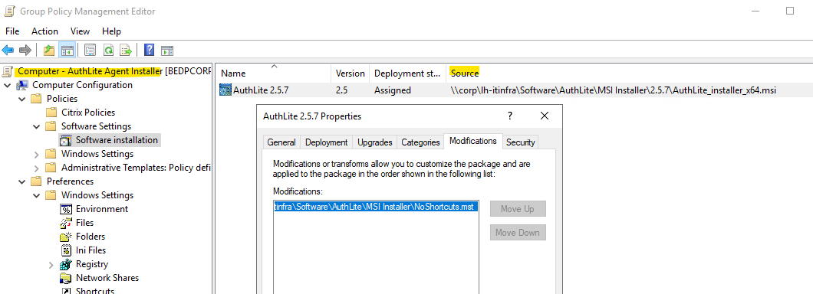

AD Security Group for file share access:
fs_softwarerepository_authlite_ro \| domain computers are part of this
for access.

## Workstations - Deployment

PDQ Deploy \> AuthLite \> Agent Installer -- Auto-reboot (
NOSHORTCUTS=1)

Or

Intune \> add computer object into entra group: Intune_App_Authlite

## Servers and Workstations - Manual Install

[\\\\corp\\lh-itinfra\\Software\\AuthLite\\exe](file:///\corp\lh-itinfra\Software\AuthLite\exe)

Setup is basic, next through until you get to product features. Make
sure only the Kernel driver is selected. By default, the installer has
"enroll in Authlite" enabled , disable this sub-feature. We are handling
enrollment via self service portal & from AuthLite enrollment app on
BEDPAUTHLITE001.

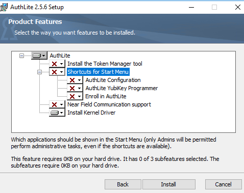

# Converting Users to Authlite Users

## Manually through AD\\UC

Simply remove the account from elevated permission group and add them to
the corresponding auth-lite protected group. For example, to convert a
domain admin , remove the account from "CORP\\Domain Admins" and add
them to the "CORP\\Authlite-protected domain admins". This can be done
before they enroll which would technically remove their privileged
access until they enroll in AuthLite.

## Conversion script

On a DC where AuthLite is installed \> run AuthLite Admin Powershell

# Self-Registration Portal Setup/Configuration

- **Reference Article**: https://www.authlite.com/docs/2_4/id_1265735773/

- Site: Authlite.logixhealth.com

- Server: BEDPAUTHLITE001

- Role/Feature: IIS , ASP NET, .NET 4.5or newer

  - IIS/web config files:
    [\\\\corp\\lh-itinfra\\Software\\AuthLite\\SelfServicePortal](file:///\corp\lh-itinfra\Software\AuthLite\SelfServicePortal)

  - IIS Physical Path: C:\\AuthLiteSelfServiceSite

- Internal Cert: BEDSUBCA001 \\ Authlite.logixhealth.com (PFX in SS)

- Reg entry (Without this, the portal will make incorrect decisions
  about whether users are in the AuthLite Users groups)

  - HKEY_LOCAL_MACHINE\\SYSTEM\\CurrentControlSet\\Control\\Lsa\\Kerberos\\Parameters

    - Create value named "CacheS4UTickets", DWORD=0

# Misc Issues

## Revision Number Mismatch

Could not MFA into BEDPCORPDC003 , not recognizing Authlite user groups.
This happens if the revision number is out of sync which **could be**
caused by possibly making changes on both dcs at the same time and not
allowing time to sync. Fix is to go into the working dc, regedit into the
non-working dc and update the revision number to match the working dc.
Then clear the cache on the non-working dc by invoking a ps command in
screenshot below

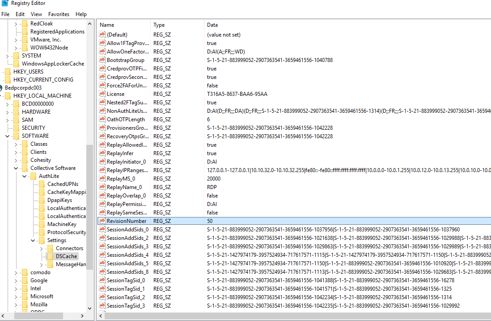

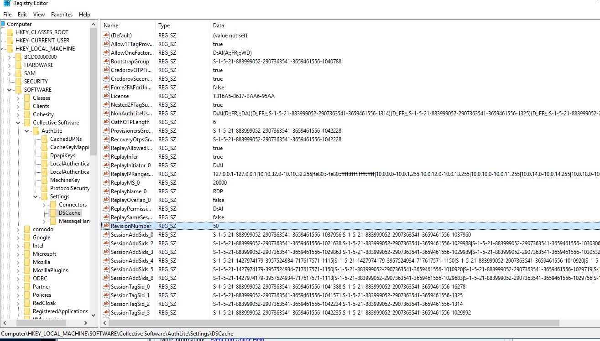

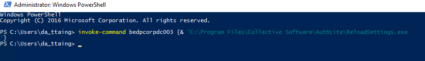

## Issues connecting to some servers

7/30/24 -- 7/31/24

Issue -- Can connect to some servers but not all. After troubleshooting,
BEDPCORPDC003 did not have the AuthLite settings in sync. Can check by
looking in the registry on each DC.

HKEY_LOCAL_MACHINE\\SOFTWARE\\Collective
Software\\AuthLite\\Settings\\DSCache

In this case, the revision numbers were the same but the settings were
not sync'd properly. If this occurs, we can set the revision number 1
behind by changing the reg value from it's current value -1. Then force
reload the settings \> C:\\Program Files\\Collective
Software\\AuthLite\\Reloadsettings

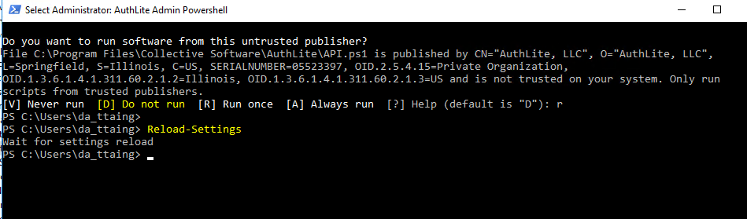

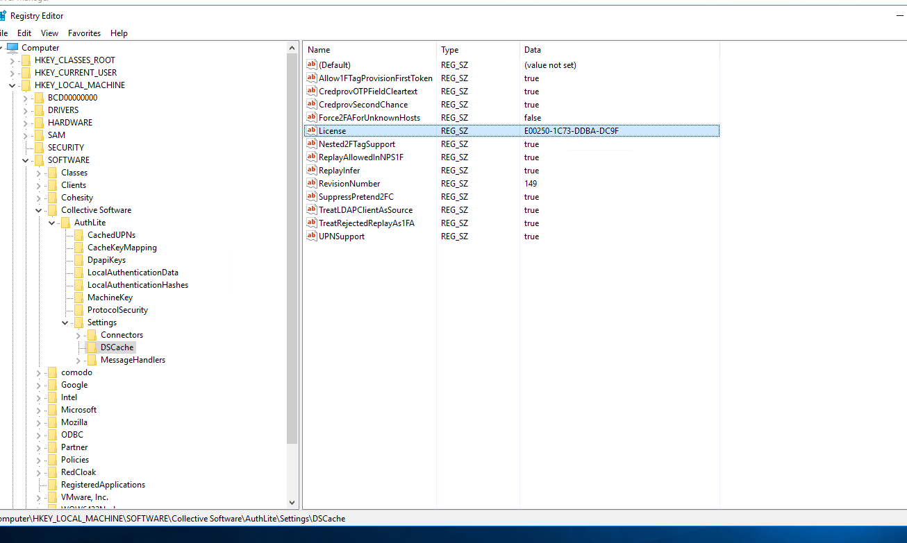

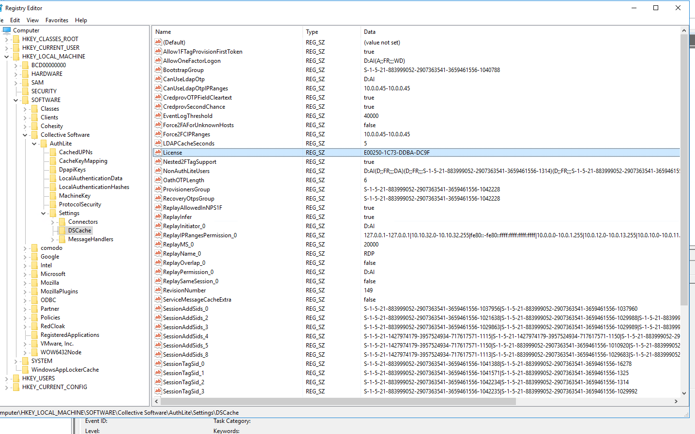

# Self Service Enrollment:

End users can enroll their OAUTH token themselves through the portal

Link: https://authlite.logixhealth.com/

1.  Enter Username & Password when prompted (Corp admin account)

2.  Add OATH Token \> Online

3.  QR Code will now appear \> Open Microsoft Authenticator app \> Add
    account (upper right hand side of app) \> Work or school account \>
    Scan QR code \> Confirm OATH token value \> Done

4.  It will appear in your Authenticator app as "CORP online"

# Login Process

To log into a server after enrolling into AuthLite MFA, you would need
to include your 6 digit code from your authenticator app in the username
field in the format of admin-###### (see screenshot for example)

#### (Windows Screenshot)

#### (Mac screenshot)

