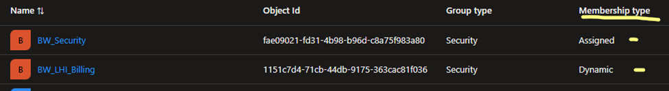
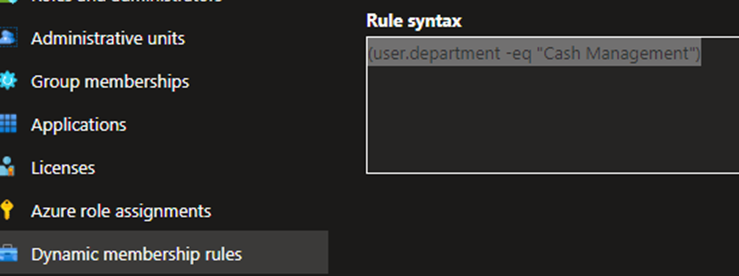
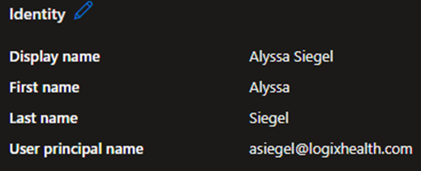
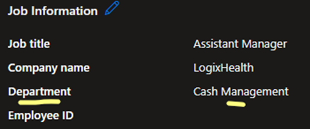
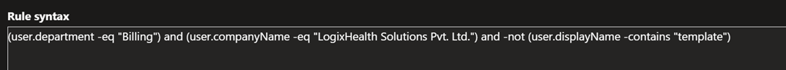
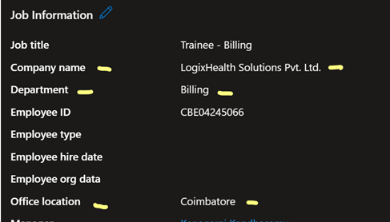
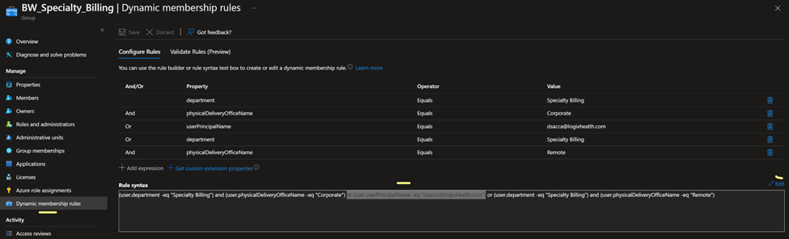

# Dynamic Groups Overview

## What is a Dynamic Group?

Dynamic groups aim to reduce the administrative overhead for IT teams by providing an efficient user management system using query-based membership. Users are automatically added to appropriate dynamic groups based on the attributes of the user or device that are relevant to them.

## How Can You Determine if a Group is Dynamic?

Groups are split between Dynamic and Assigned. Dynamic groups use query-based membership, while Assigned groups use manual add and remove membership. When navigating to groups in Entra ID or the Microsoft Admin Center, look for the membership type when searching or creating a new group. From there, you can select either assigned or dynamic, or see that the group uses a dynamic or assigned membership.

## How Did We Use Dynamic Groups with Bitwarden?

We used dynamic groups to easily invite users to Bitwarden and facilitate authentication using SSO. The main goal was to invite any user or department that was allowed to use Bitwarden, making onboarding and offboarding much easier.

### When a User is Onboarded Using Dynamic Groups

Are they automatically assigned to a Bitwarden Internal group and only allowed to see what’s in that collection?
Yes, the user is automatically added to a Bitwarden Internal group and only has access to collections that the internal group has access to.

### Can Users Added from Dynamic Groups Be Added to Other Bitwarden Internal Groups and Collections?

Yes, they can be. Dynamic groups and assigned groups from Azure are only used to invite users to Bitwarden and authenticate through SSO.

### Examples

- **Example 1:** A user was added using a Dynamic group, for example, “BW_LHI_Provider_Reimbursement.” This will invite the user, provide SSO authentication, and place the user in the “Provider Reimbursement LHI” Bitwarden Internal Group.
- **Example 2:** A LHI user was added to the assigned group “BW_LHI_Bangalore.” This will invite the user, provide SSO authentication, but will not assign them to any specific group. In this case, any Bitwarden Internal manager or admin can assign the user to a specified group or collection.

## Most Scenarios

We created a rule querying any users to be added to a specific group if they had a specific Department attribute. This example shows a dynamic group query for the “Cash Management” Department.

**Query:** `(user.department -eq "Cash Management")`

**User Attribute:** Department, Cash Management

## Advanced Scenarios

We have a company in two different locations going by two different company names or office locations. In this query, it will add any user with the “Billing” attribute under department, but only for users with the company name “LogixHealth Solutions Pvt. Ltd,” excluding anything with the name containing “template.”

**Query:** `(user.department -eq "Billing") and (user.companyName -eq "LogixHealth Solutions Pvt. Ltd.") and -not (user.displayName -contains "template")`

You can also do this same query but specify just the office location by removing `user.companyName` and replacing it with `user.officeLocation -eq “Coimbatore”`.

## User Attribute

## Adding a Single User to a Dynamic Group

Using the expression `(user.userPrincipalName -eq "username@logixhealth.com")`, replace the username with the user's username. Open the Dynamic group, go down to Dynamic membership rules, and click edit to modify the query.

Please make sure to validate the rules before saving to avoid disrupting the current process. If you are unsure, feel free to add the user to an “Assigned group” like “BW_Misc_Users” or any assigned related group to the user attributes. Then, within the Bitwarden internal web app, assign the user to the correct group or collections.

