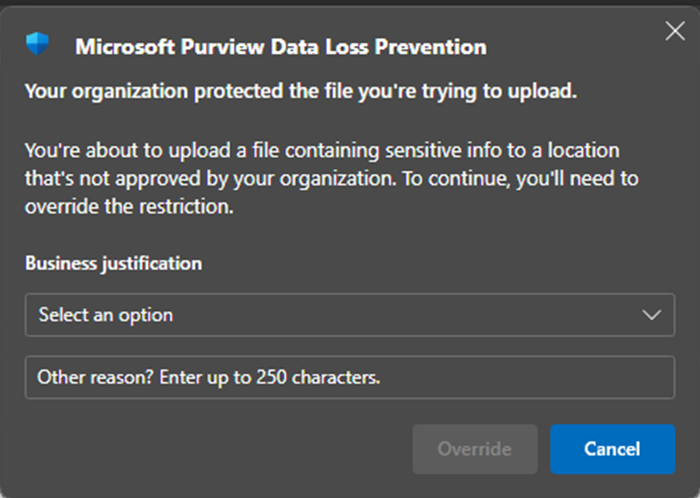

# Endpoint DLP Policy Configuration for File Uploads to Google

### Reason for Solution

This solution was set up to monitor and audit files being uploaded to Google’s service domain. It provides security measures to block or prevent data exfiltration and credential theft.

### Business Justification

This is essential for our end users who need to access files from clients using Google services such as Gmail or Google Drive.

## Requirements

1. Require users to use Edge or, for Chrome, the Browser Extension for Purview must be installed (suggest deploying this for all users).
1. The solution only works on Edge and Chrome with the extension installed (suggest blocking Firefox as a browser for sensitive files).
1. Requires a Custom DLP policy that allows uploads to Google but audits and sends an alert each time the user does so. This can be customized.

## Security Recommendations

- Recommend creating a network rule or group to allow only users in that group access to Google services.
- Recommend blocking any uploads to Gmail with the ability to override with a business justification, provided it doesn’t slow down the user’s workflow.
- Recommend blocking all uploads to Gmail on the main Endpoint DLP policy for all users, excluding only the group of users in the “DLP Specific Group.”

## Technical Overview

### Network/Web Filter

Gmail would need to be allowed, controlled by AD groups.

### DLP Settings

In “Endpoint DLP settings” under “Browser and domain restrictions to sensitive data” in “Service Domains,” the feature needs to be set to “Block.” Each service domain listed needs to be added:

- `*.mail-attachment.googleusercontent.com`
- `*.googlemail.com`
- `*.gmail.com`
- `*.mail.google.com`

**Note:** This controls whether sensitive files protected by our policies can be uploaded to specific service cloud domains from Microsoft Edge or Google Chrome when the Purview extension is installed on Chrome.

### DLP Policies

Turn on “Endpoint DLP Settings – Service Domains.” This policy is currently in simulation and is designed to detect the following. It works by using trained classifiers we have created or those provided by Microsoft. Once it detects the information, we can set it to perform an action. The actionable options are:

1. **Audit:** This allows users to upload to a blocked service domain while logging the action and sending an alert for monitoring.
1. **Block:** This blocks any attempt to upload detected sensitive data into a blocked service domain, with logs and alerts sent to the security team.
1. **Block with Override:** This blocks attempts to upload sensitive information but can be overridden with a business justification. This allows us to log and send alerts to the security team.

