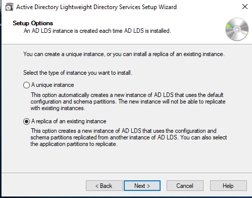
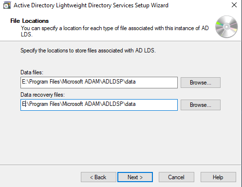

Setup a LogixHealth ADFS and LDS Server

The Development team has transitioned to using ADFS and LDS (Lightweight
directory services) to manage identity and authentication to their
applications. LDS manages the identities of the external/non-AD
authenticated Connect users.

This document will serve as a guide to configure ADFS and LDS from the
IT Infrastructure standpoint, prior to, handing off to development.

## Pre-requisites:

### Server Configuration:

a. Two drives, one for OS and one 20 GB drive for AD LDS data.

### Service Account:

a. We currently cannot do a GMSA as of this writing. Reason being, we
don't have a Managed Service Accounts OU, it was erroneously deleted
and needs to go through a special recovery process to restore. GMSA
for ADFS requires the account to be in the special Managed Service
Accounts OU.

b. You may create a normal service account for ADFS.

### ADLDS Admin Group:

It is best to support ADLDS with a designated admin group. It is very
difficult to change this after creating the ADLDS instance so be sure to
do it beforehand.

Just create a normal security group in AD here:

CORP.LOGIXHEALTH.LOCAL/AD Restricted Objects/Restricted Global Groups

Naming convention:

ADLDS_Environment_Admins, so in my case ADLDS_Training_Admins

## Configuring ADFS and ADLDS

### Obtain and import the ADFS certificate

An SSL Certificate is required for ADFS, if the ADFS will need to be
used externally a certificate will need to be purchased through
Digicert. It will also require configuration on the F5 load balancers,
but that is out of the scope of this document.

For this scenario we are going to use an internal \*.logixhealth.com
wildcard certificate generated by our internal CA
Logix_Sub_CA001.logixhealth.local

If you need help generating a certificate, please see an Infrastructure
SysAdmin for assistance.

Open the PFX file to initiate the certificate install:

Select Local Machine and click Next.

Make sure the file to import is your cert and click Next:

Enter the password stored in Secret Server and click Next

You may choose a specific folder, but for our use case we will leave it
the default. Which will be Local Machine/My (Personal)

Click Next and Finish to install.

You can verify successful installation by checking "certlm.msc" as shown
below:

### Install Required Server Roles

You can install via Server Manager GUI. But the easiest way is through
PowerShell.

Run PowerShell as an administrator and run the command below:

**Install-WindowsFeature ADFS-Federation,ADLDS -IncludeManagementTools**

### Configure ADFS

I am logging onto the server as my normal Admin account in order to
prevent caching domain admin credentials. However, Domain Admin will be
required to configure ADFS.

Open Server Manager and in the post-deployment notification click
"Configure the federation service on this server" to configure ADFS:

At the next screen you can ignore the warning that you must use a public
cert if you're only using this for internal use as we are in our case.

If this is the first federation server in the farm leave that button
selected and click Next.

![]

Supply your Domain Admin creds when prompted:

![]
At the next screen select your desired name and SSL certificate:

Standard Service Account choice:

Next select create a Windows Internal Database on this server and click
next:

At the review options page, make sure everything looks good and click
next.

The pre-requisite check will now run, if everything looks good it will
look like below:

Click Configure

You may get some warnings like below. You can ignore them we don't use
device registration:

### Step 4 -- Configure AD LDS

Run the Active Directory Lightweight Services setup wizard and click
next

Next, we are going to setup a brand new unique instance. If you're
replicating from an existing instance, you may choose that.

Give it a proper name and description, click Next

For the LDAP ports we use 4001/4002 (SSL) in the lower environments.
Production uses 7001/7002 -- these were chosen by the Development
Architecture Team.

Next, select Yes create an Active Directory Partition. And give it a
proper name. At LogixHealth we use:

CN=\[ADLDS Name\],DC=LOGIXHEALTH,DC=COM

Next change the install path to the Data drive E:\\ in our case as shown
below:

Next set the service account of the instance to the ADFS service. As
shown below:

Next is a very important step. We want to grant administrative
permissions to our ADLDS Admin group created prior. This will allow us
to easily add and remove ADLDS admins.

Next at the import LDIF files we choose:

- MS-User.LDF

- MS-UserProxyFull.LDF

Click Next, as shown below:

Click Next again if everything looks good:

To import the files authenticate as an administrative user. Make sure
you add your admins to the ADLDS group before doing this, otherwise you
the import will fail.

Click OK and the setup will complete

## Configuring a replica instance of an existing AD LDS Deployment

In this scenario we will be making a replica instance of AD LDS, this is
the production AD LDS instance running on BEDPSSOADFS001

On the new server open the AD LDS setup wizard:

Select A replica of an existing instance:

Give it the same instance name as used on the existing server:

At the next page, enter the required ports. For production we use
7001/7002:

Next enter the name and port of the existing server to join the
configuration set.

Next specify the service account for the configuration set. This is the
ADFS service account in our instance.

Click Next and the partition should appear. Click Next again:

At the drive selection page, edit and place it on the data drive. In
this case E:

Configure AD LDS to perform operations with the ADFS service account as
shown below:

At the AD LDS Administrators page, set this to your ADLDS Admin Group in
AD for the environment:

Click Next, confirm everything looks good and click next again:

This will start the replication process:

Click Finish when completed
