# Azure DevOps Training Guide for LogixHealth

# 1.1 What is Azure DevOps

Azure DevOps is a Microsoft tool which provides users with Git version control capabilities. The Azure DevOps tool provides related capabilities for project teams to manage work items, builds, and releases.

# 1.2 What is GIT

GIT provides users the ability to collaborate and manage version changes in an easy-to-use interface. Through a repository, GIT allows project team members to track the history of changes to understand when, why, and what contents were modified.

# 1.3 Why use GIT

GIT is a fast and modern way to view and control changes to a project over time. GIT’s staging capability allows users to elect which changes to commit and to identify when development improvements are required.

# 1.4 GIT Environments and Workflows

## 1.4.1 GIT Environments

# Environment Name and Description

| Environment Name | Description                                                                                     |
| ---------------- | ----------------------------------------------------------------------------------------------- |
| Sandbox          | Playground to explore and innovate; not necessarily related to development.                     |
| Development      | Code is developed and built.                                                                    |
| QA               | Releases, packages and/or artifacts are deployed and tested by developers and internal testers. |
| UAT              | Releases, packages and/or artifacts are deployed and tested by external testers and end users.  |
| Production       | All resources deployed for business users to use.                                               |

### Trunk-based Development

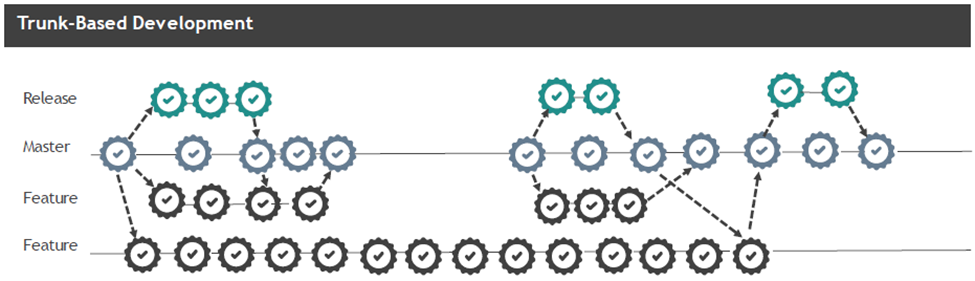

# Trunk-based Development Best Practices

- Develop in small batches
- Use feature flags
- Implement comprehensive automated testing
- Perform asynchronous code reviews
- Have 3 or fewer active branches in the core repo
- Merge branches to the trunk at least once a day
- Reduced number of code freezes and integration phases
- Build fast and execute immediately

Reference: [Trunk-based Development](https://www.atlassian.com/continuous-delivery/continuous-integration/trunk-based-development)

Microsoft git branching strategy example, focused on git-flow instead of trunk-based, but some good ideas to be familiar with and incorporate: [Microsoft Git Branching Guidance](https://learn.microsoft.com/en-us/azure/devops/repos/git/git-branching-guidance?view=azure-devops)

# Getting Started

# 2.1 Download GIT

1. Navigate to [URL](http://git-scm.com/downloads)
1. Select your Operating System to download the latest version of GIT:

   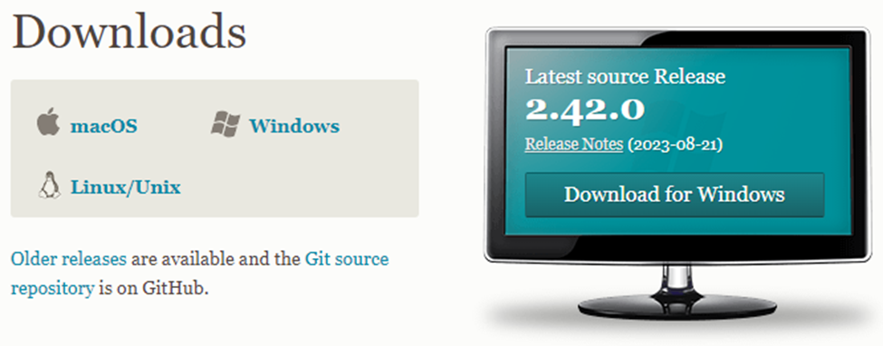

1. Follow download prompts

   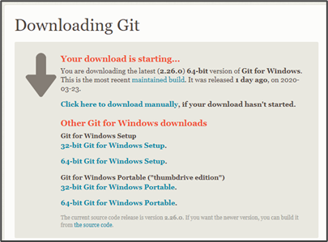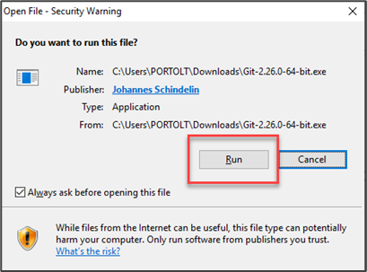
   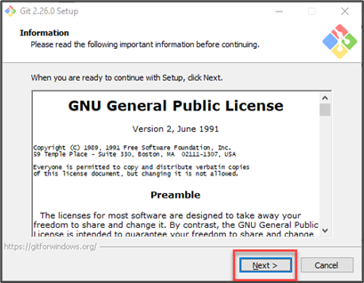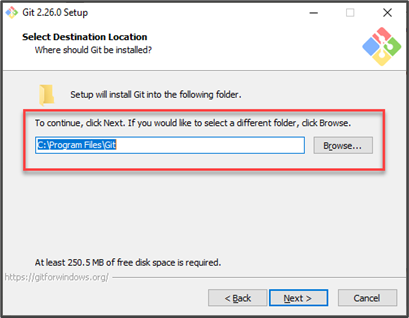
   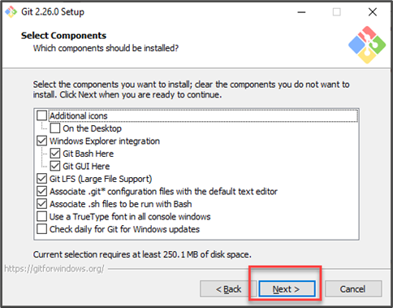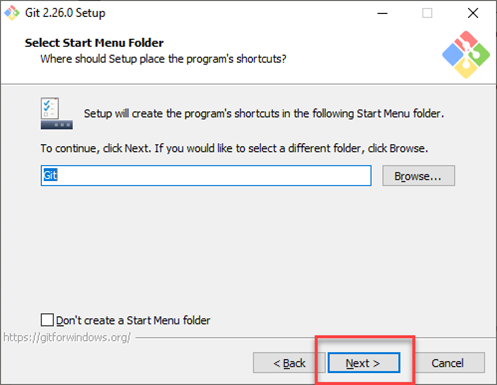
   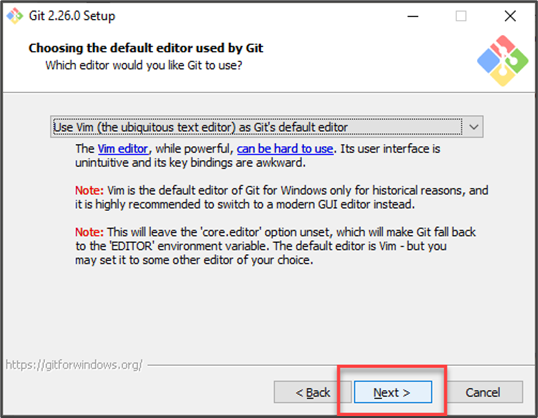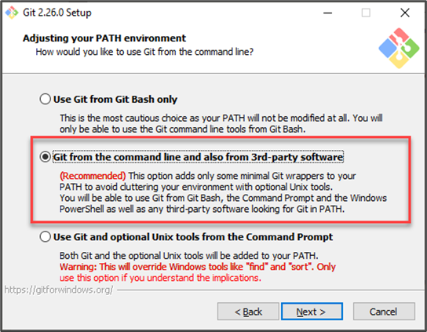
   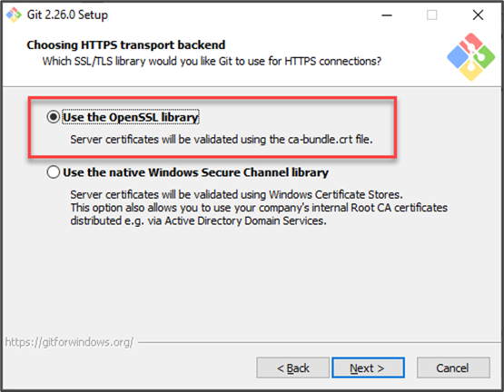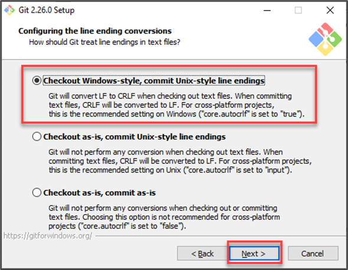
   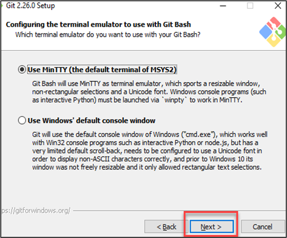

# 2.2 Logging In

1. Navigate to https://azuredevops.logixhealth.com
1. Provide your username and password credentials
1. Click Next

## Locating your project

1. Navigate to Azure DevOps landing page

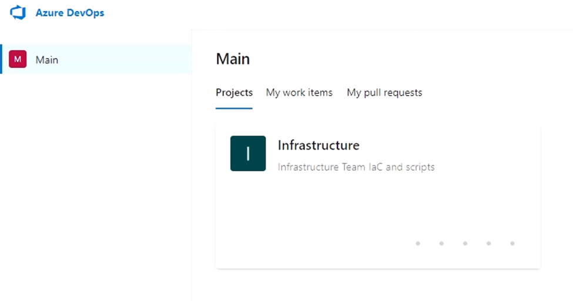

NOTE: The Projects tab will be defaulted as selected

1. Select your project

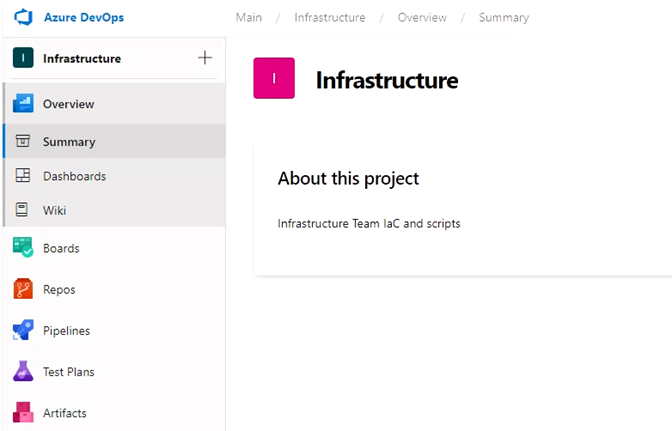

# Beginning Feature Work in DevOps

# 3.1 Create New Remote Branch

1. Navigate to Repos within DevOps and select Branches
1. Select the New Branch button on the upper right corner

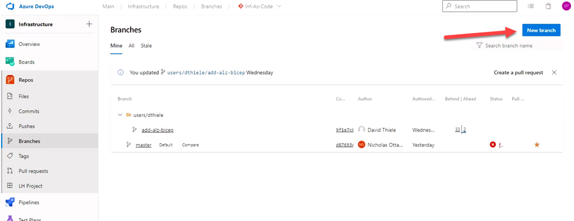

1. Populate the name of the filed

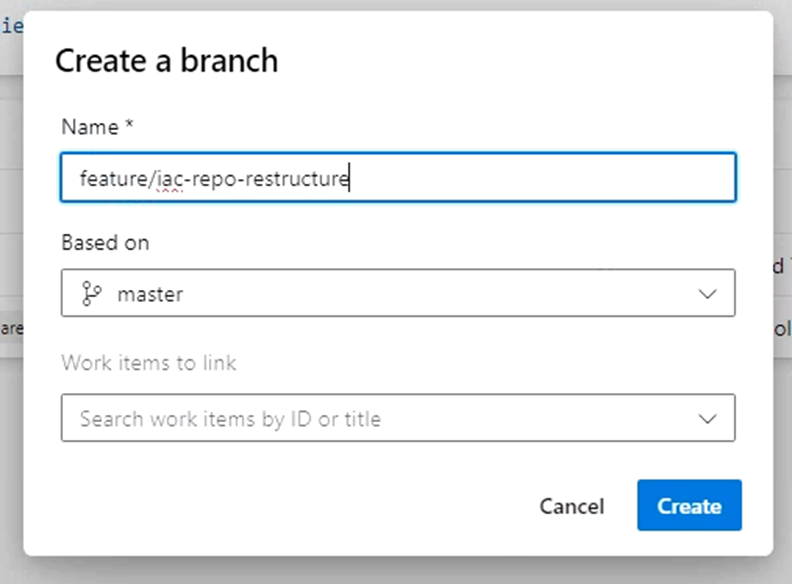

NOTE: Name the branch in accordance with best practices (see Azure DevOps standards)

NOTE: Use forward slashes to create branches within in a folder structure

1. Populate the Based On field
1. Select the master branch as the value for the Based On field

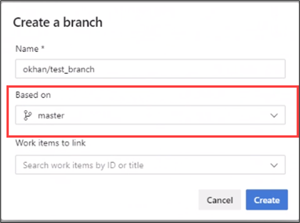

1. Resulting branch should look like the following based on above

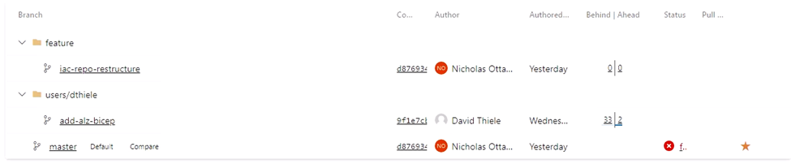

## Checkout Branch Locally

1. Navigate to the local file directory you would like to clone the repository to
1. Right click
1. Select Git Bash Here

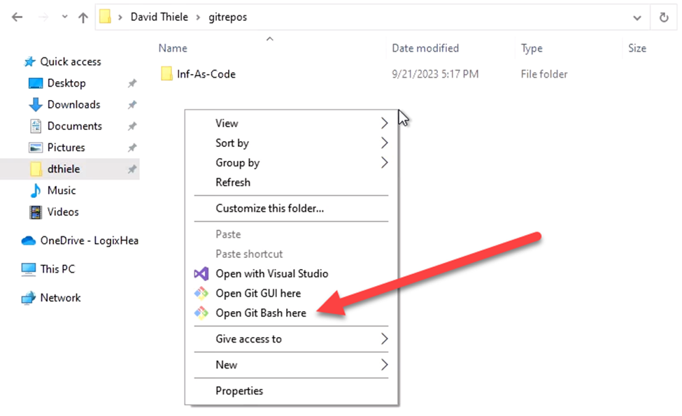

1. If not already configured, setup your git user configurations:

   `git config --global user.name “First Last”`

   `git config --global user.email “username@logixhealth.com”`

1. Using the URL of the repository, enter the following command:
   `git clone https://azuredevops.logixhealth.com/Main/Infrastructure/_git/Inf-As-Code`

Note: On your first clone, you may receive the error below. It’s caused by the "azuredevops.logixhealth.com" certificate being signed by our internal certificate authority.

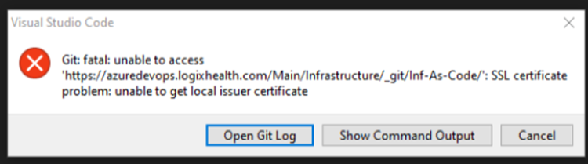

To resolve this error, you need to tell Git to trust your local certificate authority store by running the command below in your terminal:

`git config --global http.sslbackend schannel`

1. Checkout local branch to your local copy of the repository with the following command:

   `git checkout your-branch-name-here`

1. Verify that your repository has switched to the new branch

## Begin Development Work

1. Complete logical units of work
1. Make commits to ensure work effort is saved

   - To add all changes to next commit enter the command

   `git add .`

   - To commit changes, enter the command:

   `git commit -m ‘Description of change(s)’`

# 3.4 Push Development Work

# 3.4.1 All Commits Are Included

1. Push development work to the remote by using the command:

`git push`

NOTE: Azure DevOps will recognize the development pushed to the remote

# 3.4.2 Missing Recent Commits

1. If the remote has commits that your branch does not have, you will receive the below message

TODO: Add screenshot

1. To resolve, pull the most recent copy from the remote
1. Apply and commit updates
1. Push to Remote

TODO: Add screenshot

NOTE: Your changes have now been pushed to your feature branch. Continue to next section to create a Pull Request to merge your feature branch into master branch.

# 3.5 Pull Request

1. Navigate to Azure DevOps
1. Click on Repos
1. Select Pull Requests

TODO: Add screenshot

NOTE: Azure DevOps will recommend a pull request based on updates to a branch if applicable

1. Click New pull request button

TODO: Add screenshot

NOTE: Pull Requests are made by the developer

1. Fill out the fields for the New Pull Request

a. Verify the branches and the direction of the merge
i. Ensure you select your development or your parent feature branch
b. Title
c. Description
d. Tag the person or people reviewer your code (can be multiple)
e. Link the DevOps work item if one exists

TODO: Add screenshot

Note: The title will automatically populate if a single commit message is changed
Note: If multiple segments are changed, the title will remain blank.
Note: Make the title as concise as possible, using less than 120 characters and referencing work items.

1. Click Create

# 4. Azure DevOps Standards

# 4.1 Branches

# 4.1.1 Branch Types

| Branch Type | Description                                                                                                                                                                                                                                                   |
| ----------- | ------------------------------------------------------------------------------------------------------------------------------------------------------------------------------------------------------------------------------------------------------------- |
| Master      | This branch will always represent the version of the application in the production environment. Hotfixes to production will be created as a branch from master. Upon deployment of the hotfix to production, the branch will also be merged into development. |
| Feature     | When creating feature branches, ensure that the relevant work item(s) are linked to the branch.                                                                                                                                                               |

# 4.1.2 Branch Protections Policies

The “master” branch will have the following policies enforced:

1.  No direct commits by any user, all changes must be introduced via a Pull Request

To be enforced at a TBD date:

1.  Pull Requests must have a successful Continuous Integration (CI) build

1.  Pull Requests must have at least one (1) linked Work Item

1.  Pull Requests must have at least one (1) reviewer other than the author

# 4.1.3 BRANCH NAMING

# Branch naming conventions

1.  Prefer lower case names

1.  Use underscores instead of spaces

1.  Prefix with “feature/”, your username, then the branch name

`Ex: feature/foo/branch_name`

1. This creates a folder-like structure within Azure DevOps

# Feature Branch naming examples:

`bugfix/description`
`feature/feature-name`
`feature/feature-name/username1`
`feature/feature-name/username2`
`feature/feature-area/feature-name`
`hotfix/description`

# 4.2 Commits

# 4.2.1 COMMIT Best Practices

- Commit messages should be short, but descriptive to the change being made
- Link commits to Work Items (usually Tasks) as appropriate

## Pull Requests

Pull Requests will be required to move code between any of the named branches

# 4.3.1 Pull Request Branch Policies

The following best practices apply to all Pull Requests:

- Pull Requests should have a successful Continuous Integration (CI) build
- Pull Requests should have at least one (1) linked Work Item
- Pull Requests should have at least one (1) reviewer other than the author
  Is there anything else you need help with?

# 4.4 Code Review

Until the Azure DevOps Project is configured to enforce the standards documented in the Pull Requests section, a human needs to verify that the Pull Request makes sense. Some basic considerations are listed below.

- Do the linked Work Items belong on the Pull Request?
- Are the code changes required by those Work Items in the Pull Request?
- Clone and run the branch locally, execute basic sanity tests, do they all pass?
- Enforce code and commenting standards for all code changes
- For anything requiring correction, leave inline comments on the Pull Request

# 4.5 Tags

Deployments to production will create a versioned and annotated tag using semantic versioning. The project will use the standard major.minor.hotfix pattern. All production pushes prior to the initial launch will use major version 0. This will be the overall application version. Version numbers adhere to the semantic versioning specification v2.0.0: https://semver.org/spec/v2.0.0.html

Specific APIs will also be versioned separately from the overall collection of APIs. This versioning will be enforced and controlled using API Management Gateways in Azure. This will allow the technical team to monitor actual version usage and deprecate older versions as appropriate, as well as allow targeted beta testing of new versions.

# Glossary

# 5.1 GIT Terminology

| Term                    | Definition                                                                                                                                                                                                                                                                                                                                                                                                                                                                                                                                                                   |
| ----------------------- | ---------------------------------------------------------------------------------------------------------------------------------------------------------------------------------------------------------------------------------------------------------------------------------------------------------------------------------------------------------------------------------------------------------------------------------------------------------------------------------------------------------------------------------------------------------------------------- |
| Branch                  | A version of the repository that diverges from the main working project. Branches can be a new version of a repository, experimental changes, or personal forks of a repository for users to alter and test changes.                                                                                                                                                                                                                                                                                                                                                         |
| Checkout                | The git checkout command is used to switch branches in a repository. Git checkout testing-el would take you to the testing-el branch whereas Git checkout master would drop you back into master. Be careful with your staged files and commits when switching between branches.                                                                                                                                                                                                                                                                                             |
| Cherry-picking          | A clone is a copy of a repository or the action of copying a repository. When cloning a repository into another branch, the new branch becomes a remote-tracking branch that can talk upstream to its origin branch (via pushes, pulls, and fetches).                                                                                                                                                                                                                                                                                                                        |
| Fork                    | Creates a copy of a repository.                                                                                                                                                                                                                                                                                                                                                                                                                                                                                                                                              |
| Index                   | The working, or staging, area of Git. Files that have been changed, added and deleted will be staged within the index until you are ready to commit the files. To see what is set in your Git index, run git status within your repository. The green files are staged and ready to commit, whereas the red files have not yet been added to staging for the next commit.                                                                                                                                                                                                    |
| Master                  | The primary branch of all repositories. All committed and accepted changes should be on the master branch. You can work directly from the master branch or create other branches.                                                                                                                                                                                                                                                                                                                                                                                            |
| Merge                   | Taking the changes from one branch and adding them into another (traditionally master) branch. These commits are usually first requested via pull request before being merged by a project maintainer.                                                                                                                                                                                                                                                                                                                                                                       |
| Origin                  | The conventional name for the primary version of a repository. Git also uses origin as a system alias for pushing and fetching data to and from the primary branch. For example, Git push origin master, when run on a remote, will push the changes to the master branch of the primary repository database.                                                                                                                                                                                                                                                                |
| Pull Request            | If someone has changed code on a separate branch of a project and wants it to be reviewed to add to the master branch, that someone can put in a pull request. Pull requests ask the repo maintainers to review the commits made, and then, if acceptable, merge the changes upstream. A pull happens when adding the changes to the master branch.                                                                                                                                                                                                                          |
| Push                    | When rebasing a git commit, you can split the commit, move it, squash it if unwanted, or effectively combine two branches that have diverged from one another.                                                                                                                                                                                                                                                                                                                                                                                                               |
| Rebase                  | If someone has changed code on a separate branch of a project and wants it to be reviewed to add to the master branch, that someone can put in a pull request. Pull requests ask the repo maintainers to review the commits made, and then, if acceptable, merge the changes upstream. A pull happens when adding the changes to the master branch.                                                                                                                                                                                                                          |
| Remote                  | A copy of the original branch. When you clone a branch, that new branch is a remote, or clone. Remotes can talk to the origin branch, as well as other remotes for the repository, to make communication between working branches                                                                                                                                                                                                                                                                                                                                            |
| Repository A.K.A “Repo” | In many ways, you can think of a Git repository as a directory that stores all the files, folders, and content needed for your project. What it actually is, is the object database of the project, storing everything from the files themselves, to the versions of those files, commits, deletions, et cetera. Repositories are not limited by user and can be shared and copied.                                                                                                                                                                                          |
| Stash                   | While working with Git, you may need to make multiple changes to files, but you may not want all changes to go in one commit. If you want to pause the changes you are working on now in favor of working on another issue or improvement, you can “stash” your changes, essentially clearing them from the staging area until the changes are called again. You can only stash one set of changes at a time. To stash your staging area, use git stash [files]; to retrieve the stashed files, run git stash pop. You can also clear the stashed files with git stash drop. |
| Tag                     | Tags are used to define which portions of a project’s Git history is most important. Often this is used to note point releases of a project. Tags can be added to the commit you are working with or added after-the-fact when needed.                                                                                                                                                                                                                                                                                                                                       |
| Upstream                | While there is not necessarily a default “upstream” or “downstream” for Git projects, upstream can be considered where you push your Git changes — this is often the master branch of the project within the origin                                                                                                                                                                                                                                                                                                                                                          |
